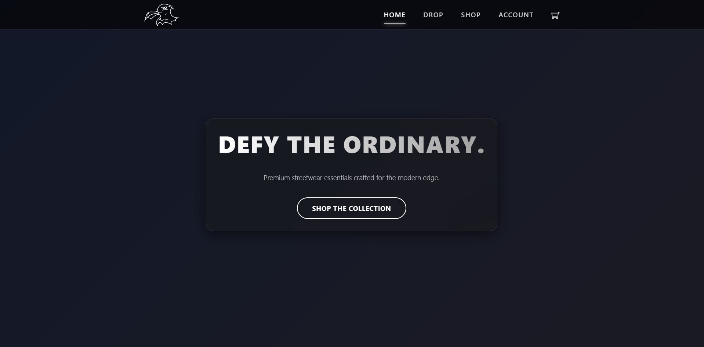
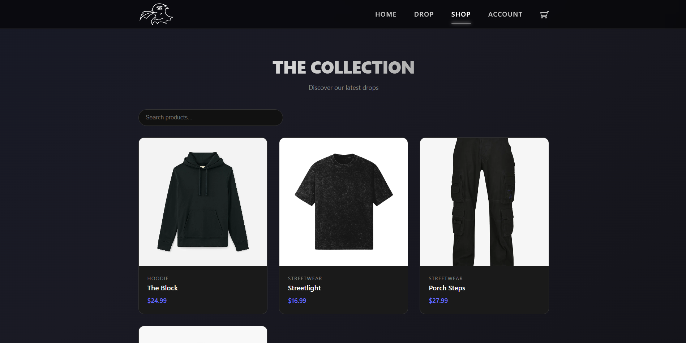
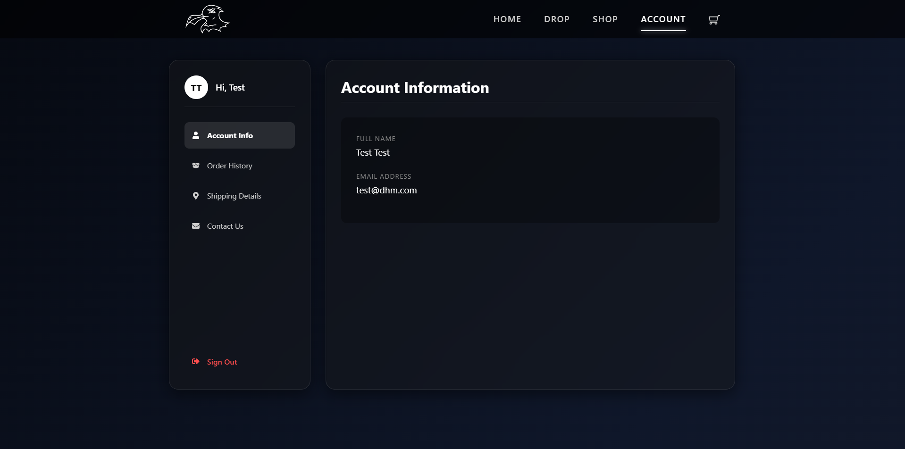

# DHM Clothing - E-Commerce Platform

DHM Clothing is a modern, full-stack E-Commerce platform built with a React frontend and an ASP.NET Core backend. It features a complete product catalog, secure shopping cart, user authentication, inventory management, and an admin dashboard.

## Architecture & Tech Stack

### Frontend (`/DHMFrontEnd`)
- **Framework**: React 19 + Vite
- **Routing**: React Router v7
- **Styling**: Bootstrap 5 + Custom CSS Modules + Framer Motion
- **Testing**: Playwright + Cucumber BDD (Behavior-Driven Development)
- **Features**: Responsive design, JWT-based authentication, dynamic product filtering, cart management.

### Backend (`/DHM.Backend`)
- **Framework**: ASP.NET Core 9 (Web API)
- **Language**: C#
- **Database**: PostgreSQL (via Entity Framework Core)
- **Testing**: xUnit (Unit & Integration Tests)
- **Features**: JWT Auth, AutoMapper, Repository Pattern, Dependency Injection, SMTP Email Integration.

## Project Structure

```
DHM/
│
├── DHMFrontEnd/               # React Vite Application
│   ├── src/                   # Components, Pages, and Hooks
│   ├── support/               # Playwright + Cucumber Step Definitions
│   └── package.json           # Frontend dependencies
│
├── DHM.Backend/               # ASP.NET Core Solution
│   ├── DHM.API/               # REST API Controllers & Configuration
│   ├── DHM.Application/       # Business Logic & DTOs
│   ├── DHM.Domain/            # Entities & Interfaces
│   ├── DHM.Infrastructure/    # EF Core DbContext & Repositories
│   ├── DHM.UnitTests/         # xUnit Unit Tests (Moq)
│   └── DHM.IntegrationTests/  # xUnit Integration Tests (InMemory DB)
│
└── README.md                  # This documentation
```

## Setup & Installation

### Prerequisites
- Node.js (v18+)
- .NET 9 SDK
- PostgreSQL Server

### Backend Setup
1. Navigate to the API directory:
   ```bash
   cd DHM.Backend/DHM.API
   ```
2. Set up your user secrets (for Database Connection, JWT, and SMTP):
   ```bash
   dotnet user-secrets set "ConnectionStrings:DefaultConnection" "Host=localhost;Port=5432;Database=dhmdatabase;Username=postgres;Password=YOUR_PASSWORD"
   dotnet user-secrets set "JwtSettings:Secret" "YOUR_SUPER_SECRET_JWT_KEY_HERE"
   ```
3. Apply database migrations:
   ```bash
   dotnet ef database update
   ```
4. Run the API:
   ```bash
   dotnet run
   ```
   *The API will be available at `http://localhost:5090`.*

### Frontend Setup
1. Navigate to the frontend directory:
   ```bash
   cd DHMFrontEnd
   ```
2. Install dependencies:
   ```bash
   npm install
   ```
3. Run the development server:
   ```bash
   npm run dev
   ```
   *The frontend will be available at `http://localhost:5173`.*

## Testing

### Backend Tests
The backend contains a suite of Unit and Integration tests verifying core business logic.
```bash
cd DHM.Backend
dotnet test DHM.Backend.sln
```

### Frontend End-to-End Tests
The frontend utilizes a robust Playwright + Cucumber BDD architecture for black-box critical path testing.
```bash
cd DHMFrontEnd
npx cucumber-js -c config/cucumber.js
```

## Docker Deployment

This project is structured and prepared for containerization. Ensure both the `DHMFrontEnd` and `DHM.Backend` are mounted or built into images using their respective `Dockerfile`s (or via a root `docker-compose.yml`).

## Photos



